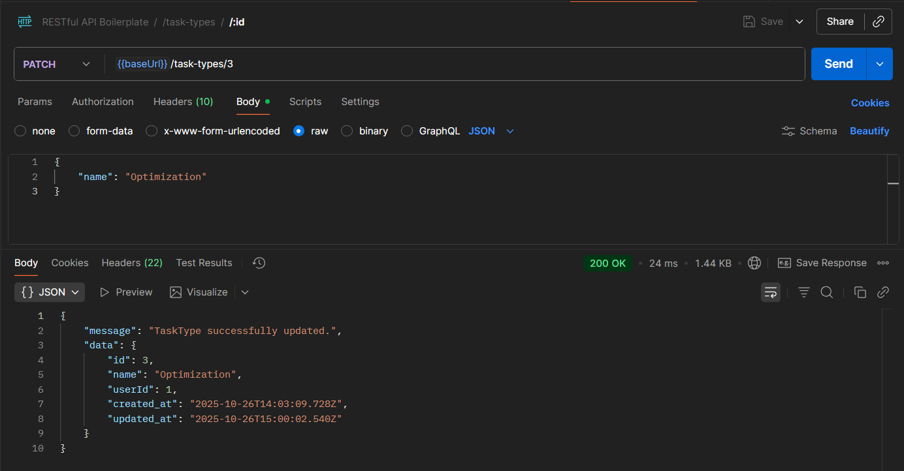

# Workshop-5 Report - Expanding the API

In this workshop, we focused on expanding the existing functionality by adding new entities and endpoints to our RESTful API.
My ideas included implementing task types and tasks, allowing users to categorize and manage their tasks effectively.

## Screenshots from Postman

Here you can find screenshots demonstrating the functionality of the newly added endpoints using Postman.

### States Endpoints

#### Get All States


The full response:

```json
{
  "message": "List of states.",
  "data": [
    {
      "id": 1,
      "name": "To Do",
      "created_at": "2025-10-26T14:03:09.661Z",
      "updated_at": "2025-10-26T14:03:09.661Z",
      "user": {
        "id": 1,
        "email": "admin@admin.com",
        "password": "$2a$08$JN6iP0yrP0c51F5caG.jd.KyvTFm84o9hBBoRdu5/CMGmBQjGX8ou",
        "username": "Heisenberg",
        "name": "Walter White",
        "role": "ADMINISTRATOR",
        "language": "en-US",
        "created_at": "2025-10-26T14:03:09.385Z",
        "updated_at": "2025-10-26T14:03:09.385Z"
      }
    },
    {
      "id": 2,
      "name": "In Progress",
      "created_at": "2025-10-26T14:03:09.672Z",
      "updated_at": "2025-10-26T14:03:09.672Z",
      "user": {
        "id": 1,
        "email": "admin@admin.com",
        "password": "$2a$08$JN6iP0yrP0c51F5caG.jd.KyvTFm84o9hBBoRdu5/CMGmBQjGX8ou",
        "username": "Heisenberg",
        "name": "Walter White",
        "role": "ADMINISTRATOR",
        "language": "en-US",
        "created_at": "2025-10-26T14:03:09.385Z",
        "updated_at": "2025-10-26T14:03:09.385Z"
      }
    },
    {
      "id": 3,
      "name": "In Review",
      "created_at": "2025-10-26T14:03:09.680Z",
      "updated_at": "2025-10-26T14:03:09.680Z",
      "user": {
        "id": 1,
        "email": "admin@admin.com",
        "password": "$2a$08$JN6iP0yrP0c51F5caG.jd.KyvTFm84o9hBBoRdu5/CMGmBQjGX8ou",
        "username": "Heisenberg",
        "name": "Walter White",
        "role": "ADMINISTRATOR",
        "language": "en-US",
        "created_at": "2025-10-26T14:03:09.385Z",
        "updated_at": "2025-10-26T14:03:09.385Z"
      }
    },
    {
      "id": 4,
      "name": "Done",
      "created_at": "2025-10-26T14:03:09.688Z",
      "updated_at": "2025-10-26T14:03:09.688Z",
      "user": {
        "id": 1,
        "email": "admin@admin.com",
        "password": "$2a$08$JN6iP0yrP0c51F5caG.jd.KyvTFm84o9hBBoRdu5/CMGmBQjGX8ou",
        "username": "Heisenberg",
        "name": "Walter White",
        "role": "ADMINISTRATOR",
        "language": "en-US",
        "created_at": "2025-10-26T14:03:09.385Z",
        "updated_at": "2025-10-26T14:03:09.385Z"
      }
    },
    {
      "id": 5,
      "name": "Cancelled",
      "created_at": "2025-10-26T14:03:09.697Z",
      "updated_at": "2025-10-26T14:03:09.697Z",
      "user": {
        "id": 1,
        "email": "admin@admin.com",
        "password": "$2a$08$JN6iP0yrP0c51F5caG.jd.KyvTFm84o9hBBoRdu5/CMGmBQjGX8ou",
        "username": "Heisenberg",
        "name": "Walter White",
        "role": "ADMINISTRATOR",
        "language": "en-US",
        "created_at": "2025-10-26T14:03:09.385Z",
        "updated_at": "2025-10-26T14:03:09.385Z"
      }
    }
  ]
}
```

---

#### Get State by ID


The full response:

```json
{
  "message": "State found",
  "data": {
    "id": 1,
    "name": "To Do",
    "created_at": "2025-10-26T14:03:09.661Z",
    "updated_at": "2025-10-26T14:03:09.661Z",
    "user": {
      "id": 1,
      "email": "admin@admin.com",
      "password": "$2a$08$JN6iP0yrP0c51F5caG.jd.KyvTFm84o9hBBoRdu5/CMGmBQjGX8ou",
      "username": "Heisenberg",
      "name": "Walter White",
      "role": "ADMINISTRATOR",
      "language": "en-US",
      "created_at": "2025-10-26T14:03:09.385Z",
      "updated_at": "2025-10-26T14:03:09.385Z"
    }
  }
}
```

---

#### Get States of Logged-In User


The full response:

```json
{
  "message": "List of your states.",
  "data": [
    {
      "id": 1,
      "name": "To Do",
      "created_at": "2025-10-26T14:03:09.661Z",
      "updated_at": "2025-10-26T14:03:09.661Z",
      "user": {
        "id": 1,
        "email": "admin@admin.com",
        "password": "$2a$08$JN6iP0yrP0c51F5caG.jd.KyvTFm84o9hBBoRdu5/CMGmBQjGX8ou",
        "username": "Heisenberg",
        "name": "Walter White",
        "role": "ADMINISTRATOR",
        "language": "en-US",
        "created_at": "2025-10-26T14:03:09.385Z",
        "updated_at": "2025-10-26T14:03:09.385Z"
      }
    },
    {
      "id": 2,
      "name": "In Progress",
      "created_at": "2025-10-26T14:03:09.672Z",
      "updated_at": "2025-10-26T14:03:09.672Z",
      "user": {
        "id": 1,
        "email": "admin@admin.com",
        "password": "$2a$08$JN6iP0yrP0c51F5caG.jd.KyvTFm84o9hBBoRdu5/CMGmBQjGX8ou",
        "username": "Heisenberg",
        "name": "Walter White",
        "role": "ADMINISTRATOR",
        "language": "en-US",
        "created_at": "2025-10-26T14:03:09.385Z",
        "updated_at": "2025-10-26T14:03:09.385Z"
      }
    },
    {
      "id": 3,
      "name": "In Review",
      "created_at": "2025-10-26T14:03:09.680Z",
      "updated_at": "2025-10-26T14:03:09.680Z",
      "user": {
        "id": 1,
        "email": "admin@admin.com",
        "password": "$2a$08$JN6iP0yrP0c51F5caG.jd.KyvTFm84o9hBBoRdu5/CMGmBQjGX8ou",
        "username": "Heisenberg",
        "name": "Walter White",
        "role": "ADMINISTRATOR",
        "language": "en-US",
        "created_at": "2025-10-26T14:03:09.385Z",
        "updated_at": "2025-10-26T14:03:09.385Z"
      }
    },
    {
      "id": 4,
      "name": "Done",
      "created_at": "2025-10-26T14:03:09.688Z",
      "updated_at": "2025-10-26T14:03:09.688Z",
      "user": {
        "id": 1,
        "email": "admin@admin.com",
        "password": "$2a$08$JN6iP0yrP0c51F5caG.jd.KyvTFm84o9hBBoRdu5/CMGmBQjGX8ou",
        "username": "Heisenberg",
        "name": "Walter White",
        "role": "ADMINISTRATOR",
        "language": "en-US",
        "created_at": "2025-10-26T14:03:09.385Z",
        "updated_at": "2025-10-26T14:03:09.385Z"
      }
    },
    {
      "id": 5,
      "name": "Cancelled",
      "created_at": "2025-10-26T14:03:09.697Z",
      "updated_at": "2025-10-26T14:03:09.697Z",
      "user": {
        "id": 1,
        "email": "admin@admin.com",
        "password": "$2a$08$JN6iP0yrP0c51F5caG.jd.KyvTFm84o9hBBoRdu5/CMGmBQjGX8ou",
        "username": "Heisenberg",
        "name": "Walter White",
        "role": "ADMINISTRATOR",
        "language": "en-US",
        "created_at": "2025-10-26T14:03:09.385Z",
        "updated_at": "2025-10-26T14:03:09.385Z"
      }
    }
  ]
}
```

---

#### Create New State


The full response:

```json
{
  "message": "State successfully created.",
  "data": {
    "name": "QA Review",
    "userId": 1,
    "id": 6,
    "created_at": "2025-10-26T14:26:52.616Z",
    "updated_at": "2025-10-26T14:26:52.616Z"
  }
}
```

---

#### Update State


The full response:

```json
{
  "message": "State successfully updated.",
  "data": {
    "id": 1,
    "name": "Not Started",
    "userId": 1,
    "created_at": "2025-10-26T14:03:09.661Z",
    "updated_at": "2025-10-26T14:29:11.891Z"
  }
}
```

---

#### Delete State


The full response:

```json
{
  "message": "State successfully deleted.",
  "data": {
    "id": 5,
    "name": "Cancelled"
  }
}
```

### Task Types Endpoints

#### Get All Task Types


The full response:

```json
{
  "message": "List of task types.",
  "data": [
    {
      "id": 1,
      "name": "Feature",
      "created_at": "2025-10-26T14:03:09.711Z",
      "updated_at": "2025-10-26T14:03:09.711Z",
      "user": {
        "id": 1,
        "email": "admin@admin.com",
        "password": "$2a$08$JN6iP0yrP0c51F5caG.jd.KyvTFm84o9hBBoRdu5/CMGmBQjGX8ou",
        "username": "Heisenberg",
        "name": "Walter White",
        "role": "ADMINISTRATOR",
        "language": "en-US",
        "created_at": "2025-10-26T14:03:09.385Z",
        "updated_at": "2025-10-26T14:03:09.385Z"
      }
    },
    {
      "id": 2,
      "name": "Bug",
      "created_at": "2025-10-26T14:03:09.722Z",
      "updated_at": "2025-10-26T14:03:09.722Z",
      "user": {
        "id": 1,
        "email": "admin@admin.com",
        "password": "$2a$08$JN6iP0yrP0c51F5caG.jd.KyvTFm84o9hBBoRdu5/CMGmBQjGX8ou",
        "username": "Heisenberg",
        "name": "Walter White",
        "role": "ADMINISTRATOR",
        "language": "en-US",
        "created_at": "2025-10-26T14:03:09.385Z",
        "updated_at": "2025-10-26T14:03:09.385Z"
      }
    },
    {
      "id": 3,
      "name": "Improvement",
      "created_at": "2025-10-26T14:03:09.728Z",
      "updated_at": "2025-10-26T14:03:09.728Z",
      "user": {
        "id": 1,
        "email": "admin@admin.com",
        "password": "$2a$08$JN6iP0yrP0c51F5caG.jd.KyvTFm84o9hBBoRdu5/CMGmBQjGX8ou",
        "username": "Heisenberg",
        "name": "Walter White",
        "role": "ADMINISTRATOR",
        "language": "en-US",
        "created_at": "2025-10-26T14:03:09.385Z",
        "updated_at": "2025-10-26T14:03:09.385Z"
      }
    },
    {
      "id": 4,
      "name": "Documentation",
      "created_at": "2025-10-26T14:03:09.736Z",
      "updated_at": "2025-10-26T14:03:09.736Z",
      "user": {
        "id": 1,
        "email": "admin@admin.com",
        "password": "$2a$08$JN6iP0yrP0c51F5caG.jd.KyvTFm84o9hBBoRdu5/CMGmBQjGX8ou",
        "username": "Heisenberg",
        "name": "Walter White",
        "role": "ADMINISTRATOR",
        "language": "en-US",
        "created_at": "2025-10-26T14:03:09.385Z",
        "updated_at": "2025-10-26T14:03:09.385Z"
      }
    },
    {
      "id": 5,
      "name": "Research",
      "created_at": "2025-10-26T14:03:09.743Z",
      "updated_at": "2025-10-26T14:03:09.743Z",
      "user": {
        "id": 1,
        "email": "admin@admin.com",
        "password": "$2a$08$JN6iP0yrP0c51F5caG.jd.KyvTFm84o9hBBoRdu5/CMGmBQjGX8ou",
        "username": "Heisenberg",
        "name": "Walter White",
        "role": "ADMINISTRATOR",
        "language": "en-US",
        "created_at": "2025-10-26T14:03:09.385Z",
        "updated_at": "2025-10-26T14:03:09.385Z"
      }
    },
    {
      "id": 6,
      "name": "Meeting",
      "created_at": "2025-10-26T14:03:09.749Z",
      "updated_at": "2025-10-26T14:03:09.749Z",
      "user": {
        "id": 1,
        "email": "admin@admin.com",
        "password": "$2a$08$JN6iP0yrP0c51F5caG.jd.KyvTFm84o9hBBoRdu5/CMGmBQjGX8ou",
        "username": "Heisenberg",
        "name": "Walter White",
        "role": "ADMINISTRATOR",
        "language": "en-US",
        "created_at": "2025-10-26T14:03:09.385Z",
        "updated_at": "2025-10-26T14:03:09.385Z"
      }
    }
  ]
}
```

---

#### Get Task Type by ID


The full response:

```json
{
  "message": "TaskType found",
  "data": {
    "id": 1,
    "name": "Feature",
    "created_at": "2025-10-26T14:03:09.711Z",
    "updated_at": "2025-10-26T14:03:09.711Z",
    "user": {
      "id": 1,
      "email": "admin@admin.com",
      "password": "$2a$08$JN6iP0yrP0c51F5caG.jd.KyvTFm84o9hBBoRdu5/CMGmBQjGX8ou",
      "username": "Heisenberg",
      "name": "Walter White",
      "role": "ADMINISTRATOR",
      "language": "en-US",
      "created_at": "2025-10-26T14:03:09.385Z",
      "updated_at": "2025-10-26T14:03:09.385Z"
    }
  }
}
```

---

#### Get Task Types of Logged-In User


The full response:

```json
{
  "message": "List of your task types.",
  "data": [
    {
      "id": 1,
      "name": "Feature",
      "created_at": "2025-10-26T14:03:09.711Z",
      "updated_at": "2025-10-26T14:03:09.711Z",
      "user": {
        "id": 1,
        "email": "admin@admin.com",
        "password": "$2a$08$JN6iP0yrP0c51F5caG.jd.KyvTFm84o9hBBoRdu5/CMGmBQjGX8ou",
        "username": "Heisenberg",
        "name": "Walter White",
        "role": "ADMINISTRATOR",
        "language": "en-US",
        "created_at": "2025-10-26T14:03:09.385Z",
        "updated_at": "2025-10-26T14:03:09.385Z"
      }
    },
    {
      "id": 2,
      "name": "Bug",
      "created_at": "2025-10-26T14:03:09.722Z",
      "updated_at": "2025-10-26T14:03:09.722Z",
      "user": {
        "id": 1,
        "email": "admin@admin.com",
        "password": "$2a$08$JN6iP0yrP0c51F5caG.jd.KyvTFm84o9hBBoRdu5/CMGmBQjGX8ou",
        "username": "Heisenberg",
        "name": "Walter White",
        "role": "ADMINISTRATOR",
        "language": "en-US",
        "created_at": "2025-10-26T14:03:09.385Z",
        "updated_at": "2025-10-26T14:03:09.385Z"
      }
    },
    {
      "id": 3,
      "name": "Improvement",
      "created_at": "2025-10-26T14:03:09.728Z",
      "updated_at": "2025-10-26T14:03:09.728Z",
      "user": {
        "id": 1,
        "email": "admin@admin.com",
        "password": "$2a$08$JN6iP0yrP0c51F5caG.jd.KyvTFm84o9hBBoRdu5/CMGmBQjGX8ou",
        "username": "Heisenberg",
        "name": "Walter White",
        "role": "ADMINISTRATOR",
        "language": "en-US",
        "created_at": "2025-10-26T14:03:09.385Z",
        "updated_at": "2025-10-26T14:03:09.385Z"
      }
    },
    {
      "id": 4,
      "name": "Documentation",
      "created_at": "2025-10-26T14:03:09.736Z",
      "updated_at": "2025-10-26T14:03:09.736Z",
      "user": {
        "id": 1,
        "email": "admin@admin.com",
        "password": "$2a$08$JN6iP0yrP0c51F5caG.jd.KyvTFm84o9hBBoRdu5/CMGmBQjGX8ou",
        "username": "Heisenberg",
        "name": "Walter White",
        "role": "ADMINISTRATOR",
        "language": "en-US",
        "created_at": "2025-10-26T14:03:09.385Z",
        "updated_at": "2025-10-26T14:03:09.385Z"
      }
    },
    {
      "id": 5,
      "name": "Research",
      "created_at": "2025-10-26T14:03:09.743Z",
      "updated_at": "2025-10-26T14:03:09.743Z",
      "user": {
        "id": 1,
        "email": "admin@admin.com",
        "password": "$2a$08$JN6iP0yrP0c51F5caG.jd.KyvTFm84o9hBBoRdu5/CMGmBQjGX8ou",
        "username": "Heisenberg",
        "name": "Walter White",
        "role": "ADMINISTRATOR",
        "language": "en-US",
        "created_at": "2025-10-26T14:03:09.385Z",
        "updated_at": "2025-10-26T14:03:09.385Z"
      }
    },
    {
      "id": 6,
      "name": "Meeting",
      "created_at": "2025-10-26T14:03:09.749Z",
      "updated_at": "2025-10-26T14:03:09.749Z",
      "user": {
        "id": 1,
        "email": "admin@admin.com",
        "password": "$2a$08$JN6iP0yrP0c51F5caG.jd.KyvTFm84o9hBBoRdu5/CMGmBQjGX8ou",
        "username": "Heisenberg",
        "name": "Walter White",
        "role": "ADMINISTRATOR",
        "language": "en-US",
        "created_at": "2025-10-26T14:03:09.385Z",
        "updated_at": "2025-10-26T14:03:09.385Z"
      }
    }
  ]
}
```

---

#### Create New Task Type


The full response:

```json
{
  "message": "TaskType successfully created.",
  "data": {
    "name": "Refactoring",
    "userId": 1,
    "id": 7,
    "created_at": "2025-10-26T14:47:33.676Z",
    "updated_at": "2025-10-26T14:47:33.676Z"
  }
}
```

---

#### Update Task Type



The full response:

```json
{
  "message": "TaskType successfully updated.",
  "data": {
    "id": 3,
    "name": "Optimization",
    "userId": 1,
    "created_at": "2025-10-26T14:03:09.728Z",
    "updated_at": "2025-10-26T15:00:02.540Z"
  }
}
```

---

#### Delete Task Type


The full response:

```json
{
  "message": "TaskType successfully deleted.",
  "data": {
    "id": 3,
    "name": "Optimization"
  }
}
```

### Tasks Endpoints

#### Get All Tasks


The full response:

```json
{
  "message": "List of tasks.",
  "data": [
    {
      "id": 4,
      "title": "Implement user profile page",
      "description": "Create a page where users can edit their profile information",
      "priority": "MEDIUM",
      "dueDate": "2025-10-31T14:03:09.783Z",
      "created_at": "2025-10-26T14:03:09.808Z",
      "updated_at": "2025-10-26T14:03:09.808Z",
      "user": {
        "id": 1,
        "email": "admin@admin.com",
        "password": "$2a$08$JN6iP0yrP0c51F5caG.jd.KyvTFm84o9hBBoRdu5/CMGmBQjGX8ou",
        "username": "Heisenberg",
        "name": "Walter White",
        "role": "ADMINISTRATOR",
        "language": "en-US",
        "created_at": "2025-10-26T14:03:09.385Z",
        "updated_at": "2025-10-26T14:03:09.385Z"
      },
      "state": {
        "id": 2,
        "name": "In Progress",
        "userId": 1,
        "created_at": "2025-10-26T14:03:09.672Z",
        "updated_at": "2025-10-26T14:03:09.672Z"
      },
      "taskType": {
        "id": 1,
        "name": "Feature",
        "userId": 1,
        "created_at": "2025-10-26T14:03:09.711Z",
        "updated_at": "2025-10-26T14:03:09.711Z"
      }
    },
    {
      "id": 1,
      "title": "Setup production environment",
      "description": "Configure Docker and deploy the application to production server",
      "priority": "HIGH",
      "dueDate": "2025-11-02T14:03:09.783Z",
      "created_at": "2025-10-26T14:03:09.784Z",
      "updated_at": "2025-10-26T14:03:09.784Z",
      "user": {
        "id": 1,
        "email": "admin@admin.com",
        "password": "$2a$08$JN6iP0yrP0c51F5caG.jd.KyvTFm84o9hBBoRdu5/CMGmBQjGX8ou",
        "username": "Heisenberg",
        "name": "Walter White",
        "role": "ADMINISTRATOR",
        "language": "en-US",
        "created_at": "2025-10-26T14:03:09.385Z",
        "updated_at": "2025-10-26T14:03:09.385Z"
      },
      "state": {
        "id": 2,
        "name": "In Progress",
        "userId": 1,
        "created_at": "2025-10-26T14:03:09.672Z",
        "updated_at": "2025-10-26T14:03:09.672Z"
      },
      "taskType": {
        "id": 1,
        "name": "Feature",
        "userId": 1,
        "created_at": "2025-10-26T14:03:09.711Z",
        "updated_at": "2025-10-26T14:03:09.711Z"
      }
    },
    {
      "id": 5,
      "title": "Write API documentation",
      "description": "Document all API endpoints with examples",
      "priority": "LOW",
      "dueDate": "2025-10-25T14:03:09.783Z",
      "created_at": "2025-10-26T14:03:09.818Z",
      "updated_at": "2025-10-26T14:03:09.818Z",
      "user": {
        "id": 1,
        "email": "admin@admin.com",
        "password": "$2a$08$JN6iP0yrP0c51F5caG.jd.KyvTFm84o9hBBoRdu5/CMGmBQjGX8ou",
        "username": "Heisenberg",
        "name": "Walter White",
        "role": "ADMINISTRATOR",
        "language": "en-US",
        "created_at": "2025-10-26T14:03:09.385Z",
        "updated_at": "2025-10-26T14:03:09.385Z"
      },
      "state": {
        "id": 4,
        "name": "Done",
        "userId": 1,
        "created_at": "2025-10-26T14:03:09.688Z",
        "updated_at": "2025-10-26T14:03:09.688Z"
      },
      "taskType": {
        "id": 4,
        "name": "Documentation",
        "userId": 1,
        "created_at": "2025-10-26T14:03:09.736Z",
        "updated_at": "2025-10-26T14:03:09.736Z"
      }
    },
    {
      "id": 3,
      "title": "Research new database optimization techniques",
      "description": "Investigate query optimization strategies for TypeORM",
      "priority": "MEDIUM",
      "dueDate": "2025-11-09T14:03:09.783Z",
      "created_at": "2025-10-26T14:03:09.802Z",
      "updated_at": "2025-10-26T14:03:09.802Z",
      "user": {
        "id": 1,
        "email": "admin@admin.com",
        "password": "$2a$08$JN6iP0yrP0c51F5caG.jd.KyvTFm84o9hBBoRdu5/CMGmBQjGX8ou",
        "username": "Heisenberg",
        "name": "Walter White",
        "role": "ADMINISTRATOR",
        "language": "en-US",
        "created_at": "2025-10-26T14:03:09.385Z",
        "updated_at": "2025-10-26T14:03:09.385Z"
      },
      "state": {
        "id": 1,
        "name": "Not Started",
        "userId": 1,
        "created_at": "2025-10-26T14:03:09.661Z",
        "updated_at": "2025-10-26T14:29:11.891Z"
      },
      "taskType": {
        "id": 5,
        "name": "Research",
        "userId": 1,
        "created_at": "2025-10-26T14:03:09.743Z",
        "updated_at": "2025-10-26T14:03:09.743Z"
      }
    },
    {
      "id": 2,
      "title": "Fix authentication bug",
      "description": "Users are experiencing issues with JWT token expiration",
      "priority": "HIGH",
      "dueDate": "2025-10-28T14:03:09.783Z",
      "created_at": "2025-10-26T14:03:09.795Z",
      "updated_at": "2025-10-26T14:03:09.795Z",
      "user": {
        "id": 1,
        "email": "admin@admin.com",
        "password": "$2a$08$JN6iP0yrP0c51F5caG.jd.KyvTFm84o9hBBoRdu5/CMGmBQjGX8ou",
        "username": "Heisenberg",
        "name": "Walter White",
        "role": "ADMINISTRATOR",
        "language": "en-US",
        "created_at": "2025-10-26T14:03:09.385Z",
        "updated_at": "2025-10-26T14:03:09.385Z"
      },
      "state": {
        "id": 1,
        "name": "Not Started",
        "userId": 1,
        "created_at": "2025-10-26T14:03:09.661Z",
        "updated_at": "2025-10-26T14:29:11.891Z"
      },
      "taskType": {
        "id": 2,
        "name": "Bug",
        "userId": 1,
        "created_at": "2025-10-26T14:03:09.722Z",
        "updated_at": "2025-10-26T14:03:09.722Z"
      }
    }
  ]
}
```

---

#### Get Task by ID


The full response:

```json
{
  "message": "Task found",
  "data": {
    "id": 3,
    "title": "Research new database optimization techniques",
    "description": "Investigate query optimization strategies for TypeORM",
    "priority": "MEDIUM",
    "dueDate": "2025-11-09T14:03:09.783Z",
    "created_at": "2025-10-26T14:03:09.802Z",
    "updated_at": "2025-10-26T14:03:09.802Z",
    "user": {
      "id": 1,
      "email": "admin@admin.com",
      "password": "$2a$08$JN6iP0yrP0c51F5caG.jd.KyvTFm84o9hBBoRdu5/CMGmBQjGX8ou",
      "username": "Heisenberg",
      "name": "Walter White",
      "role": "ADMINISTRATOR",
      "language": "en-US",
      "created_at": "2025-10-26T14:03:09.385Z",
      "updated_at": "2025-10-26T14:03:09.385Z"
    },
    "state": {
      "id": 1,
      "name": "Not Started",
      "userId": 1,
      "created_at": "2025-10-26T14:03:09.661Z",
      "updated_at": "2025-10-26T14:29:11.891Z"
    },
    "taskType": {
      "id": 5,
      "name": "Research",
      "userId": 1,
      "created_at": "2025-10-26T14:03:09.743Z",
      "updated_at": "2025-10-26T14:03:09.743Z"
    }
  }
}
```

---

#### Get Tasks of Logged-In User


The full response:

```json
{
  "message": "List of your tasks.",
  "data": [
    {
      "id": 1,
      "title": "Setup production environment",
      "description": "Configure Docker and deploy the application to production server",
      "priority": "HIGH",
      "dueDate": "2025-11-02T14:03:09.783Z",
      "created_at": "2025-10-26T14:03:09.784Z",
      "updated_at": "2025-10-26T14:03:09.784Z",
      "user": {
        "id": 1,
        "email": "admin@admin.com",
        "password": "$2a$08$JN6iP0yrP0c51F5caG.jd.KyvTFm84o9hBBoRdu5/CMGmBQjGX8ou",
        "username": "Heisenberg",
        "name": "Walter White",
        "role": "ADMINISTRATOR",
        "language": "en-US",
        "created_at": "2025-10-26T14:03:09.385Z",
        "updated_at": "2025-10-26T14:03:09.385Z"
      },
      "state": {
        "id": 2,
        "name": "In Progress",
        "userId": 1,
        "created_at": "2025-10-26T14:03:09.672Z",
        "updated_at": "2025-10-26T14:03:09.672Z"
      },
      "taskType": {
        "id": 1,
        "name": "Feature",
        "userId": 1,
        "created_at": "2025-10-26T14:03:09.711Z",
        "updated_at": "2025-10-26T14:03:09.711Z"
      }
    },
    {
      "id": 2,
      "title": "Fix authentication bug",
      "description": "Users are experiencing issues with JWT token expiration",
      "priority": "HIGH",
      "dueDate": "2025-10-28T14:03:09.783Z",
      "created_at": "2025-10-26T14:03:09.795Z",
      "updated_at": "2025-10-26T14:03:09.795Z",
      "user": {
        "id": 1,
        "email": "admin@admin.com",
        "password": "$2a$08$JN6iP0yrP0c51F5caG.jd.KyvTFm84o9hBBoRdu5/CMGmBQjGX8ou",
        "username": "Heisenberg",
        "name": "Walter White",
        "role": "ADMINISTRATOR",
        "language": "en-US",
        "created_at": "2025-10-26T14:03:09.385Z",
        "updated_at": "2025-10-26T14:03:09.385Z"
      },
      "state": {
        "id": 1,
        "name": "Not Started",
        "userId": 1,
        "created_at": "2025-10-26T14:03:09.661Z",
        "updated_at": "2025-10-26T14:29:11.891Z"
      },
      "taskType": {
        "id": 2,
        "name": "Bug",
        "userId": 1,
        "created_at": "2025-10-26T14:03:09.722Z",
        "updated_at": "2025-10-26T14:03:09.722Z"
      }
    },
    {
      "id": 3,
      "title": "Research new database optimization techniques",
      "description": "Investigate query optimization strategies for TypeORM",
      "priority": "MEDIUM",
      "dueDate": "2025-11-09T14:03:09.783Z",
      "created_at": "2025-10-26T14:03:09.802Z",
      "updated_at": "2025-10-26T14:03:09.802Z",
      "user": {
        "id": 1,
        "email": "admin@admin.com",
        "password": "$2a$08$JN6iP0yrP0c51F5caG.jd.KyvTFm84o9hBBoRdu5/CMGmBQjGX8ou",
        "username": "Heisenberg",
        "name": "Walter White",
        "role": "ADMINISTRATOR",
        "language": "en-US",
        "created_at": "2025-10-26T14:03:09.385Z",
        "updated_at": "2025-10-26T14:03:09.385Z"
      },
      "state": {
        "id": 1,
        "name": "Not Started",
        "userId": 1,
        "created_at": "2025-10-26T14:03:09.661Z",
        "updated_at": "2025-10-26T14:29:11.891Z"
      },
      "taskType": {
        "id": 5,
        "name": "Research",
        "userId": 1,
        "created_at": "2025-10-26T14:03:09.743Z",
        "updated_at": "2025-10-26T14:03:09.743Z"
      }
    },
    {
      "id": 4,
      "title": "Implement user profile page",
      "description": "Create a page where users can edit their profile information",
      "priority": "MEDIUM",
      "dueDate": "2025-10-31T14:03:09.783Z",
      "created_at": "2025-10-26T14:03:09.808Z",
      "updated_at": "2025-10-26T14:03:09.808Z",
      "user": {
        "id": 1,
        "email": "admin@admin.com",
        "password": "$2a$08$JN6iP0yrP0c51F5caG.jd.KyvTFm84o9hBBoRdu5/CMGmBQjGX8ou",
        "username": "Heisenberg",
        "name": "Walter White",
        "role": "ADMINISTRATOR",
        "language": "en-US",
        "created_at": "2025-10-26T14:03:09.385Z",
        "updated_at": "2025-10-26T14:03:09.385Z"
      },
      "state": {
        "id": 2,
        "name": "In Progress",
        "userId": 1,
        "created_at": "2025-10-26T14:03:09.672Z",
        "updated_at": "2025-10-26T14:03:09.672Z"
      },
      "taskType": {
        "id": 1,
        "name": "Feature",
        "userId": 1,
        "created_at": "2025-10-26T14:03:09.711Z",
        "updated_at": "2025-10-26T14:03:09.711Z"
      }
    },
    {
      "id": 5,
      "title": "Write API documentation",
      "description": "Document all API endpoints with examples",
      "priority": "LOW",
      "dueDate": "2025-10-25T14:03:09.783Z",
      "created_at": "2025-10-26T14:03:09.818Z",
      "updated_at": "2025-10-26T14:03:09.818Z",
      "user": {
        "id": 1,
        "email": "admin@admin.com",
        "password": "$2a$08$JN6iP0yrP0c51F5caG.jd.KyvTFm84o9hBBoRdu5/CMGmBQjGX8ou",
        "username": "Heisenberg",
        "name": "Walter White",
        "role": "ADMINISTRATOR",
        "language": "en-US",
        "created_at": "2025-10-26T14:03:09.385Z",
        "updated_at": "2025-10-26T14:03:09.385Z"
      },
      "state": {
        "id": 4,
        "name": "Done",
        "userId": 1,
        "created_at": "2025-10-26T14:03:09.688Z",
        "updated_at": "2025-10-26T14:03:09.688Z"
      },
      "taskType": {
        "id": 4,
        "name": "Documentation",
        "userId": 1,
        "created_at": "2025-10-26T14:03:09.736Z",
        "updated_at": "2025-10-26T14:03:09.736Z"
      }
    }
  ]
}
```

---

#### Create New Task


The full response:

```json
{
  "message": "Task successfully created.",
  "data": {
    "title": "Implement registration functionality.",
    "description": "Implement endpoint /auth/register",
    "priority": "HIGH",
    "userId": 1,
    "stateId": 1,
    "taskTypeId": 1,
    "dueDate": "2026-02-01T00:00:00.000Z",
    "id": 6,
    "created_at": "2025-10-26T15:17:58.682Z",
    "updated_at": "2025-10-26T15:17:58.682Z"
  }
}
```

---

#### Update Task


The full response:

```json
{
  "message": "Task successfully updated.",
  "data": {
    "id": 5,
    "title": "Write API endpoints documentation",
    "description": "Document all API endpoints with examples",
    "priority": "LOW",
    "userId": 1,
    "taskTypeId": 4,
    "stateId": 4,
    "dueDate": "2025-10-25T14:03:09.783Z",
    "created_at": "2025-10-26T14:03:09.818Z",
    "updated_at": "2025-10-26T15:50:20.493Z"
  }
}
```

---

#### Delete Task


The full response:

```json
{
  "message": "Task successfully deleted.",
  "data": {
    "id": 1,
    "title": "Setup production environment"
  }
}
```
