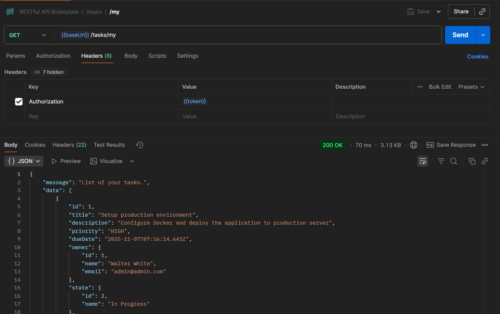
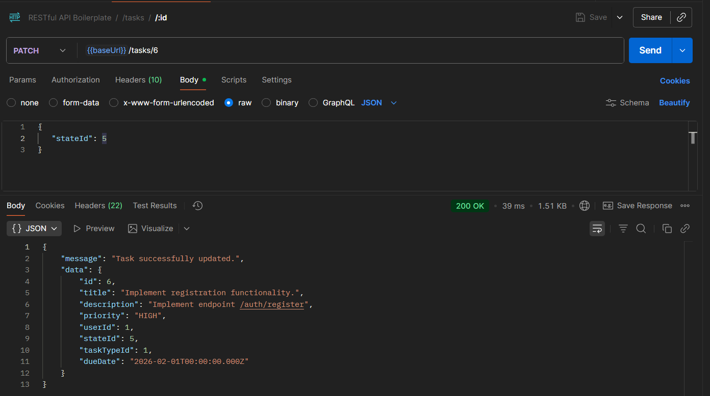

# Workshop-5 Report - Refactoring

During Workshop-5, we focused on refactoring our existing codebase to improve its structure, readability, and maintainability.
Refactoring is an essential practice in software development that helps to eliminate technical debt and enhance the overall quality of the code.
During this workshop. we separate business logic from controller layer, add DTOs and middlewares for validation.

## Our current architecture

- **Controllers**: Handle incoming requests and delegate tasks to services.
- **Services**: Contain business logic and interact with repositories.
- **Repositories**: Manage data access and persistence. (Provided by TypeORM)
- **Middlewares**: Handle cross-cutting concerns such as validation and authentication.

### Controllers

Here is an example of a refactored controller:

```typescript
import { Request, Response, NextFunction } from 'express';

import { CreateTaskRequestDTO } from '../../dto/task/CreateTaskRequestDTO';
import { SavedTaskResponseDTO } from '../../dto/task/SavedTaskResponseDTO';
import TaskService from '../../services/TaskService';

export const create = async (req: Request, res: Response, next: NextFunction) => {
  const { title, description, priority, stateId, taskTypeId, dueDate } = req.body;
  const userId = req.jwtPayload.id;

  const taskService = new TaskService();

  try {
    const createTaskRequestDTO = new CreateTaskRequestDTO(
      title,
      description,
      priority,
      userId,
      stateId,
      taskTypeId,
      dueDate,
    );
    const savedTask = await taskService.create(createTaskRequestDTO);

    res.customSuccess(201, 'Task successfully created.', new SavedTaskResponseDTO(savedTask));
  } catch (err) {
    return next(err);
  }
};
```

This controller method handles the creation of a new task. It extracts the necessary data from the request, creates a DTO, and delegates the task creation to the `TaskService`.

### Services

Here is an example of a refactored service:

```typescript
import { getRepository, Repository } from 'typeorm';

import { CreateTaskRequestDTO } from '../dto/task/CreateTaskRequestDTO';
import { UpdateTaskRequestDTO } from '../dto/task/UpdateTaskRequestDTO';
import { Task } from '../orm/entities/tasks';
import { CustomError } from '../utils/response/custom-error/CustomError';

class TaskService {
  private taskRepository: Repository<Task> = getRepository(Task);

  public async create(data: CreateTaskRequestDTO): Promise<Task> {
    const task = new Task();
    task.title = data.title;
    task.description = data.description;
    task.priority = data.priority;
    task.userId = data.userId;
    task.stateId = data.stateId;
    task.taskTypeId = data.taskTypeId;

    if (data.dueDate) {
      task.dueDate = new Date(data.dueDate);
    }

    try {
      return await this.taskRepository.save(task);
    } catch (err) {
      throw new CustomError(400, 'Raw', `Task can't be created.`, null, err);
    }
  }

  public async getAll(): Promise<Task[]> {
    try {
      return await this.taskRepository.find({
        relations: ['user', 'state', 'taskType'],
        select: ['id', 'title', 'description', 'priority', 'dueDate', 'created_at', 'updated_at'],
      });
    } catch (err) {
      throw new CustomError(400, 'Raw', `Can't retrieve list of tasks.`, null, err);
    }
  }

  public async getByUserId(userId: number): Promise<Task[]> {
    try {
      return await this.taskRepository.find({
        where: { userId },
        relations: ['user', 'state', 'taskType'],
        select: ['id', 'title', 'description', 'priority', 'dueDate', 'created_at', 'updated_at'],
      });
    } catch (err) {
      throw new CustomError(400, 'Raw', `Can't retrieve list of tasks.`, null, err);
    }
  }

  public async getById(id: string | number): Promise<Task> {
    try {
      const task = await this.taskRepository.findOne(id, {
        relations: ['user', 'state', 'taskType'],
        select: ['id', 'title', 'description', 'priority', 'dueDate', 'created_at', 'updated_at'],
      });

      if (!task) {
        throw new CustomError(404, 'General', `Task with id:${id} not found.`, ['Task not found.']);
      }

      return task;
    } catch (err) {
      if (err instanceof CustomError) {
        throw err;
      }
      throw new CustomError(400, 'Raw', 'Error', null, err);
    }
  }

  public async update(id: string | number, currentUserId: number, data: UpdateTaskRequestDTO): Promise<Task> {
    try {
      const task = await this.taskRepository.findOne({ where: { id } });

      if (!task) {
        throw new CustomError(404, 'General', `Task with id:${id} not found.`, ['Task not found.']);
      }

      if (task.userId !== currentUserId) {
        throw new CustomError(403, 'General', 'Access denied', ['You can only edit your own tasks.']);
      }

      if (data.title) task.title = data.title;
      if (data.description !== undefined) task.description = data.description;
      if (data.priority) task.priority = data.priority;
      if (data.stateId !== undefined) task.stateId = data.stateId;
      if (data.taskTypeId !== undefined) task.taskTypeId = data.taskTypeId;
      if (data.dueDate !== undefined) {
        task.dueDate = data.dueDate ? new Date(data.dueDate) : null;
      }

      try {
        return await this.taskRepository.save(task);
      } catch (err) {
        throw new CustomError(409, 'Raw', `Task can't be updated.`, null, err);
      }
    } catch (err) {
      if (err instanceof CustomError) {
        throw err;
      }
      throw new CustomError(400, 'Raw', 'Error', null, err);
    }
  }

  public async delete(id: string | number, currentUserId: number): Promise<{ id: number; title: string }> {
    try {
      const task = await this.taskRepository.findOne({ where: { id } });

      if (!task) {
        throw new CustomError(404, 'General', 'Not Found', [`Task with id:${id} doesn't exist.`]);
      }

      if (task.userId !== currentUserId) {
        throw new CustomError(403, 'General', 'Access denied', ['You can only delete your own tasks.']);
      }

      const result = { id: task.id, title: task.title };
      await this.taskRepository.delete(id);

      return result;
    } catch (err) {
      if (err instanceof CustomError) {
        throw err;
      }
      throw new CustomError(400, 'Raw', 'Error', null, err);
    }
  }
}

export default TaskService;
```

This service class encapsulates the business logic for managing tasks. It interacts with the database through the repository and handles errors appropriately.

### Middlewares

Here is an example of a validation middleware:

```typescript
import { Request, Response, NextFunction } from 'express';

import { CustomError } from 'utils/response/custom-error/CustomError';
import { ErrorValidation } from 'utils/response/custom-error/types';

import StateService from '../../../services/StateService';
import TaskTypeService from '../../../services/TaskTypeService';

export const validatorCreate = async (req: Request, res: Response, next: NextFunction) => {
  let { title } = req.body;
  const { priority, stateId, taskTypeId, dueDate } = req.body;
  const userId = req.jwtPayload.id;
  const errorsValidation: ErrorValidation[] = [];

  title = !title ? '' : title;

  if (!title.trim()) {
    errorsValidation.push({ title: 'Title is required' });
  }

  if (title.length > 200) {
    errorsValidation.push({ title: 'Title must be maximum 200 characters' });
  }

  if (!priority) {
    errorsValidation.push({ priority: 'Priority is required' });
  } else if (!['LOW', 'MEDIUM', 'HIGH'].includes(priority)) {
    errorsValidation.push({ priority: 'Priority must be LOW, MEDIUM, or HIGH' });
  }

  if (!stateId) {
    errorsValidation.push({ stateId: 'State ID is required' });
  } else {
    try {
      const stateService = new StateService();
      const state = await stateService.getStateById(stateId);

      if (!state) {
        errorsValidation.push({ stateId: `State with id:${stateId} not found` });
      } else if (state.user.id !== userId) {
        errorsValidation.push({ stateId: 'State must belong to you' });
      }
    } catch (err) {
      errorsValidation.push({ stateId: 'Invalid state ID' });
    }
  }

  if (!taskTypeId) {
    errorsValidation.push({ taskTypeId: 'Task Type ID is required' });
  } else {
    try {
      const taskTypeService = new TaskTypeService();
      const taskType = await taskTypeService.show(taskTypeId);

      if (!taskType) {
        errorsValidation.push({ taskTypeId: `TaskType with id:${taskTypeId} not found` });
      } else if (taskType.user.id !== userId) {
        errorsValidation.push({ taskTypeId: 'TaskType must belong to you' });
      }
    } catch (err) {
      errorsValidation.push({ taskTypeId: 'Invalid task type ID' });
    }
  }

  if (!dueDate) {
    errorsValidation.push({ dueDate: 'Due date is required' });
  } else {
    const date = new Date(dueDate);
    if (isNaN(date.getTime())) {
      errorsValidation.push({ dueDate: 'Invalid date format' });
    }
  }

  if (errorsValidation.length !== 0) {
    const customError = new CustomError(
      400,
      'Validation',
      'Create task validation error',
      null,
      null,
      errorsValidation,
    );
    return next(customError);
  }
  return next();
};
```

This middleware validates the incoming request data for creating a new task. It checks for required fields and ensures that they meet specific criteria before allowing the request to proceed to the controller.

### DTOs

Here is an example of a DTO that returns after creating/updating a task:

```typescript
import { Task } from '../../orm/entities/tasks';

export class SavedTaskResponseDTO {
  id: number;
  title: string;
  description: string | null;
  priority: string;
  userId: number;
  stateId: number;
  taskTypeId: number;
  dueDate: Date | null;

  constructor(task: Task) {
    this.id = task.id;
    this.title = task.title;
    this.description = task.description;
    this.priority = task.priority;
    this.userId = task.userId;
    this.stateId = task.stateId;
    this.taskTypeId = task.taskTypeId;
    this.dueDate = task.dueDate;
  }
}
```

This DTO encapsulates the data that will be sent back to the client after a task is created or updated, ensuring that only the relevant information is exposed.

## Endpoints demonstration

Here you can find a screenshot demonstration of the endpoints after refactoring.
I guess it is enough to show only endpoints related to tasks as other entities follow the same pattern.

### Create Task

#### Successful Request


The full response:

```json
{
  "message": "Task successfully created.",
  "data": {
    "id": 6,
    "title": "Implement registration functionality.",
    "description": "Implement endpoint /auth/register",
    "priority": "HIGH",
    "userId": 1,
    "stateId": 1,
    "taskTypeId": 1,
    "dueDate": "2026-02-01T00:00:00.000Z"
  }
}
```

#### Bad Request - Invalid Data


The full response:

```json
{
  "errorType": "Validation",
  "errorMessage": "Create task validation error",
  "errors": null,
  "errorRaw": null,
  "errorsValidation": [
    {
      "title": "Title is required"
    },
    {
      "priority": "Priority must be LOW, MEDIUM, or HIGH"
    },
    {
      "stateId": "Invalid state ID"
    },
    {
      "taskTypeId": "Invalid task type ID"
    },
    {
      "dueDate": "Due date is required"
    }
  ],
  "stack": "CustomError: Create task validation error\n    at /app/src/middleware/validation/tasks/validatorCreate.ts:75:25\n    at Generator.throw (<anonymous>)\n    at rejected (/app/src/middleware/validation/tasks/validatorCreate.ts:6:65)\n    at processTicksAndRejections (node:internal/process/task_queues:96:5)"
}
```

---

### Get All Tasks


The full response:

```json
{
  "message": "List of tasks.",
  "data": [
    {
      "id": 6,
      "title": "Implement registration functionality.",
      "description": "Implement endpoint /auth/register",
      "priority": "HIGH",
      "dueDate": "2026-02-01T00:00:00.000Z",
      "owner": {
        "id": 1,
        "name": "Walter White",
        "email": "admin@admin.com"
      },
      "state": {
        "id": 1,
        "name": "To Do"
      },
      "taskType": {
        "id": 1,
        "name": "Feature"
      }
    },
    {
      "id": 3,
      "title": "Research new database optimization techniques",
      "description": "Investigate query optimization strategies for TypeORM",
      "priority": "MEDIUM",
      "dueDate": "2025-11-14T07:16:14.643Z",
      "owner": {
        "id": 1,
        "name": "Walter White",
        "email": "admin@admin.com"
      },
      "state": {
        "id": 1,
        "name": "To Do"
      },
      "taskType": {
        "id": 5,
        "name": "Research"
      }
    },
    {
      "id": 2,
      "title": "Fix authentication bug",
      "description": "Users are experiencing issues with JWT token expiration",
      "priority": "HIGH",
      "dueDate": "2025-11-02T07:16:14.643Z",
      "owner": {
        "id": 1,
        "name": "Walter White",
        "email": "admin@admin.com"
      },
      "state": {
        "id": 1,
        "name": "To Do"
      },
      "taskType": {
        "id": 2,
        "name": "Bug"
      }
    },
    {
      "id": 4,
      "title": "Implement user profile page",
      "description": "Create a page where users can edit their profile information",
      "priority": "MEDIUM",
      "dueDate": "2025-11-05T07:16:14.643Z",
      "owner": {
        "id": 1,
        "name": "Walter White",
        "email": "admin@admin.com"
      },
      "state": {
        "id": 2,
        "name": "In Progress"
      },
      "taskType": {
        "id": 1,
        "name": "Feature"
      }
    },
    {
      "id": 1,
      "title": "Setup production environment",
      "description": "Configure Docker and deploy the application to production server",
      "priority": "HIGH",
      "dueDate": "2025-11-07T07:16:14.643Z",
      "owner": {
        "id": 1,
        "name": "Walter White",
        "email": "admin@admin.com"
      },
      "state": {
        "id": 2,
        "name": "In Progress"
      },
      "taskType": {
        "id": 1,
        "name": "Feature"
      }
    },
    {
      "id": 5,
      "title": "Write API documentation",
      "description": "Document all API endpoints with examples",
      "priority": "LOW",
      "dueDate": "2025-10-30T07:16:14.643Z",
      "owner": {
        "id": 1,
        "name": "Walter White",
        "email": "admin@admin.com"
      },
      "state": {
        "id": 4,
        "name": "Done"
      },
      "taskType": {
        "id": 4,
        "name": "Documentation"
      }
    }
  ]
}
```

---

### Get Tasks by ID

#### Successful Request


The full response:

```json
{
  "message": "Task found",
  "data": {
    "id": 3,
    "title": "Research new database optimization techniques",
    "description": "Investigate query optimization strategies for TypeORM",
    "priority": "MEDIUM",
    "dueDate": "2025-11-14T07:16:14.643Z",
    "owner": {
      "id": 1,
      "name": "Walter White",
      "email": "admin@admin.com"
    },
    "state": {
      "id": 1,
      "name": "To Do"
    },
    "taskType": {
      "id": 5,
      "name": "Research"
    }
  }
}
```

#### Not Found


The full response:

```json
{
  "errorType": "General",
  "errorMessage": "Task with id:300 not found.",
  "errors": ["Task not found."],
  "errorRaw": null,
  "errorsValidation": null,
  "stack": "CustomError: Task with id:300 not found.\n    at TaskService.<anonymous> (/app/src/services/TaskService.ts:62:15)\n    at Generator.next (<anonymous>)\n    at fulfilled (/app/src/services/TaskService.ts:5:58)\n    at processTicksAndRejections (node:internal/process/task_queues:96:5)"
}
```

---

### Get my Tasks



The full response:

```json
{
  "message": "List of your tasks.",
  "data": [
    {
      "id": 1,
      "title": "Setup production environment",
      "description": "Configure Docker and deploy the application to production server",
      "priority": "HIGH",
      "dueDate": "2025-11-07T07:16:14.643Z",
      "owner": {
        "id": 1,
        "name": "Walter White",
        "email": "admin@admin.com"
      },
      "state": {
        "id": 2,
        "name": "In Progress"
      },
      "taskType": {
        "id": 1,
        "name": "Feature"
      }
    },
    {
      "id": 2,
      "title": "Fix authentication bug",
      "description": "Users are experiencing issues with JWT token expiration",
      "priority": "HIGH",
      "dueDate": "2025-11-02T07:16:14.643Z",
      "owner": {
        "id": 1,
        "name": "Walter White",
        "email": "admin@admin.com"
      },
      "state": {
        "id": 1,
        "name": "To Do"
      },
      "taskType": {
        "id": 2,
        "name": "Bug"
      }
    },
    {
      "id": 3,
      "title": "Research new database optimization techniques",
      "description": "Investigate query optimization strategies for TypeORM",
      "priority": "MEDIUM",
      "dueDate": "2025-11-14T07:16:14.643Z",
      "owner": {
        "id": 1,
        "name": "Walter White",
        "email": "admin@admin.com"
      },
      "state": {
        "id": 1,
        "name": "To Do"
      },
      "taskType": {
        "id": 5,
        "name": "Research"
      }
    },
    {
      "id": 4,
      "title": "Implement user profile page",
      "description": "Create a page where users can edit their profile information",
      "priority": "MEDIUM",
      "dueDate": "2025-11-05T07:16:14.643Z",
      "owner": {
        "id": 1,
        "name": "Walter White",
        "email": "admin@admin.com"
      },
      "state": {
        "id": 2,
        "name": "In Progress"
      },
      "taskType": {
        "id": 1,
        "name": "Feature"
      }
    },
    {
      "id": 5,
      "title": "Write API documentation",
      "description": "Document all API endpoints with examples",
      "priority": "LOW",
      "dueDate": "2025-10-30T07:16:14.643Z",
      "owner": {
        "id": 1,
        "name": "Walter White",
        "email": "admin@admin.com"
      },
      "state": {
        "id": 4,
        "name": "Done"
      },
      "taskType": {
        "id": 4,
        "name": "Documentation"
      }
    },
    {
      "id": 6,
      "title": "Implement registration functionality.",
      "description": "Implement endpoint /auth/register",
      "priority": "HIGH",
      "dueDate": "2026-02-01T00:00:00.000Z",
      "owner": {
        "id": 1,
        "name": "Walter White",
        "email": "admin@admin.com"
      },
      "state": {
        "id": 1,
        "name": "To Do"
      },
      "taskType": {
        "id": 1,
        "name": "Feature"
      }
    }
  ]
}
```

---

### Update Task

#### Successful Request



The full response:

```json
{
  "message": "Task successfully updated.",
  "data": {
    "id": 6,
    "title": "Implement registration functionality.",
    "description": "Implement endpoint /auth/register",
    "priority": "HIGH",
    "userId": 1,
    "stateId": 5,
    "taskTypeId": 1,
    "dueDate": "2026-02-01T00:00:00.000Z"
  }
}
```

#### Bad Request - Invalid Data


The full response:

```json
{
  "errorType": "Validation",
  "errorMessage": "Edit task validation error",
  "errors": null,
  "errorRaw": null,
  "errorsValidation": [
    {
      "stateId": "Invalid state ID"
    }
  ],
  "stack": "CustomError: Edit task validation error\n    at /app/src/middleware/validation/tasks/validatorEdit.ts:64:25\n    at Generator.throw (<anonymous>)\n    at rejected (/app/src/middleware/validation/tasks/validatorEdit.ts:6:65)\n    at processTicksAndRejections (node:internal/process/task_queues:96:5)"
}
```

---

### Delete Task

#### Successful Request


The full response:

```json
{
  "message": "Task successfully deleted.",
  "data": {
    "id": 6,
    "title": "Implement registration functionality."
  }
}
```

#### Not Found


The full response:

```json
{
  "errorType": "General",
  "errorMessage": "Not Found",
  "errors": ["Task with id:600 doesn't exist."],
  "errorRaw": null,
  "errorsValidation": null,
  "stack": "CustomError: Not Found\n    at TaskService.<anonymous> (/app/src/services/TaskService.ts:113:15)\n    at Generator.next (<anonymous>)\n    at fulfilled (/app/src/services/TaskService.ts:5:58)\n    at processTicksAndRejections (node:internal/process/task_queues:96:5)"
}
```
